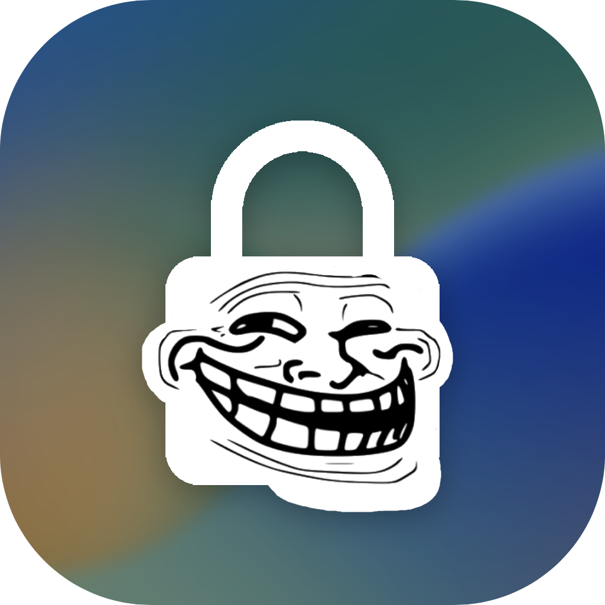

# TrollLock Reborn
TrollLock tweak (https://github.com/verygenericname/TrollLock) port for iOS 15 and up to iOS 16.1.2. Yes, I said iOS 16! No checkm8 or anything, only using the MacDirtyCow exploit. (https://github.com/zhuowei/MacDirtyCowDemo/blob/main/vm_unaligned_copy_switch_race.c) This is kind of a POC tester, but an actual tweak to iOS that works. Reboot your device to revert the changes.

# Instructions
1. Follow the instructions from in my Discord server (https://discord.gg/4EFEYnFb7x) in #trolllock channel. The message with the instructions should be pinned.
2. Press the start button
3. Press the first option
4. Choose the folder, mostly it's the third one for notched devices and the first one should be for iPhone 14 Pro and Pro Max.

**Might not work for the first time! Try a few times, and each time respring afterwards**

# Credits
- https://github.com/zhuowei (MacDirtyCow exploit)
- https://github.com/verygenericname (Idea, assets, help)
